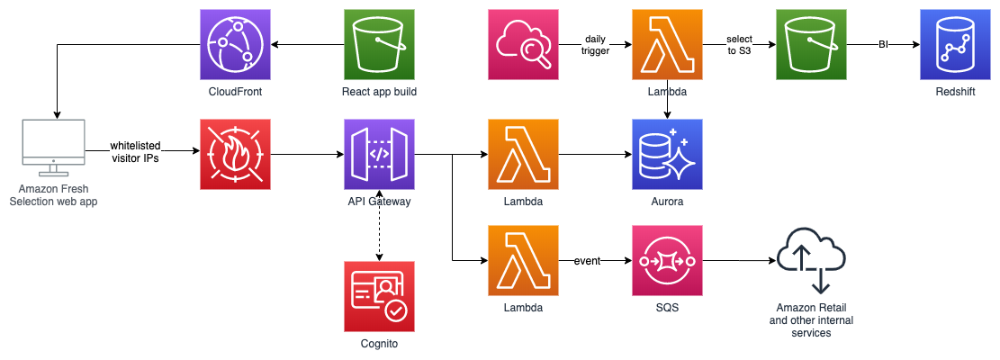

# Amazon Fresh: Serverless Product Selection at Amazon Fresh

## Video

## Summary

Amazon Fresh team built a product selection workflow solution on AWS. This event-driven, serverless architecture leverages Lambda, S3, CloudFront, API Gateway, WAF, Cognito, RDS Aurora, CloudWatch, and SQS. Adopting AWS allowed them to iterate more quickly, reduce operational overhead, and ultimately improve product selection for Amazon Fresh customers.

## Diagram

## draw.io file

[https://drive.google.com/file/d/1rZLx1bOhJUatUpBaXTycbJfkH4lcSxMk/view?usp=sharing](https://drive.google.com/file/d/1rZLx1bOhJUatUpBaXTycbJfkH4lcSxMk/view?usp=sharing)

## Notes
