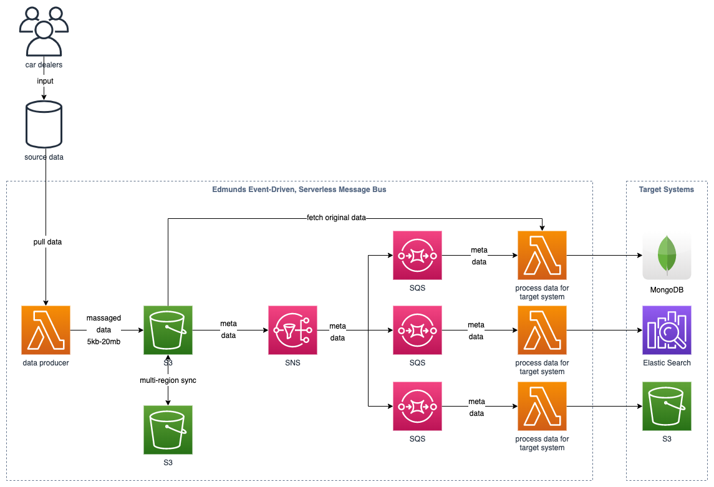

# Edmunds: Event-Driven, Serverless, and Cost-Effective Enterprise Message Bus

## Video

## Summary

[Edmunds](https://www.edmunds.com/) built an event-driven, serverless message bus that costs 18-20X less than their previous solution and runs much faster. They used SNS, SQS, Lambda, CloudWatch, and multiple features of S3 to build a resilient, efficient, and decoupled architecture.

## System design (recreated)

