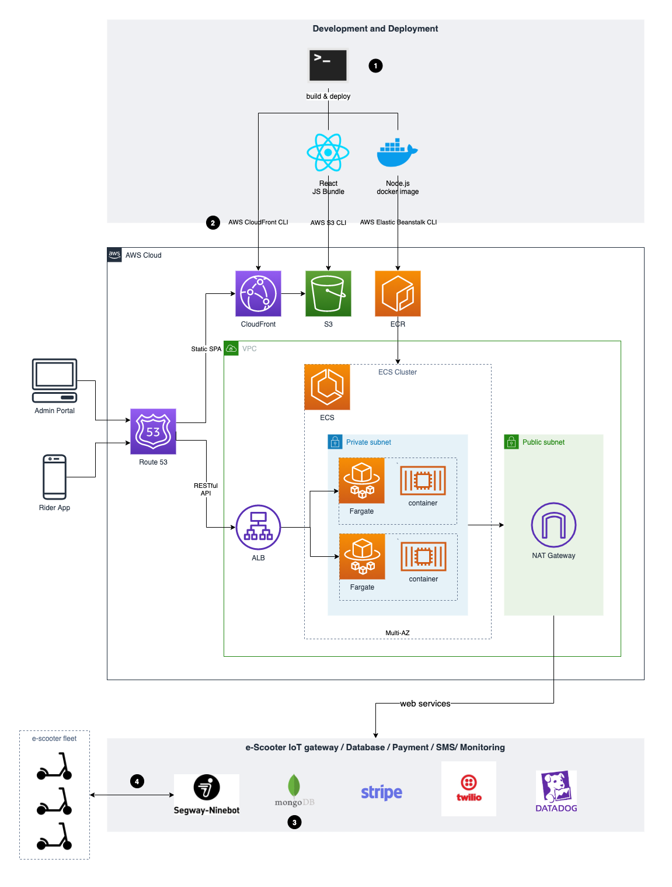

# fuutr.co - a Lime-like e-scooter sharing platform (2018-2019, defunct)

## Summary

An attempt to launch a Lime-like e-scooter sharing platform in Australia.

Tech stack: Node.js, React, MongoDB, Docker, Elastic Beanstalk, ECS, Fargate, S3, Cloudfront, Stripe, Twilio, Swift

## System design (recreated from memory)

## Notes

1. Due to the time constrain (4-month intensive sprint) and team-size (1 tech co-founder, 1 part-time contractor), there was no CI/CD process. Deployments were done through running SHELL scripts which essentially invoke AWS CLI commands.

2. Part of the front-end deployment was to invalidate existing React bundle cached on CloudFront.

3. MonoDB Atlas cluster provides its own auto-scaling strategy.

4. Besides outbound requests to lock/unlock e-scooters through Ninebot IoT gateway, there was also a stream of in-bound webhook callback reporting latest e-scooter status, e.g.: GPS coordinates, battery, speed, etc. While the current architecture design was able to handle a small fleet of e-scooters, it might become a single point of failure due to the sheer volume of inbound data. Therefore, we need to consider a message queuing mechanism (SQS) and downstream data processing micro services (Lambda or dedicated EKS task).
