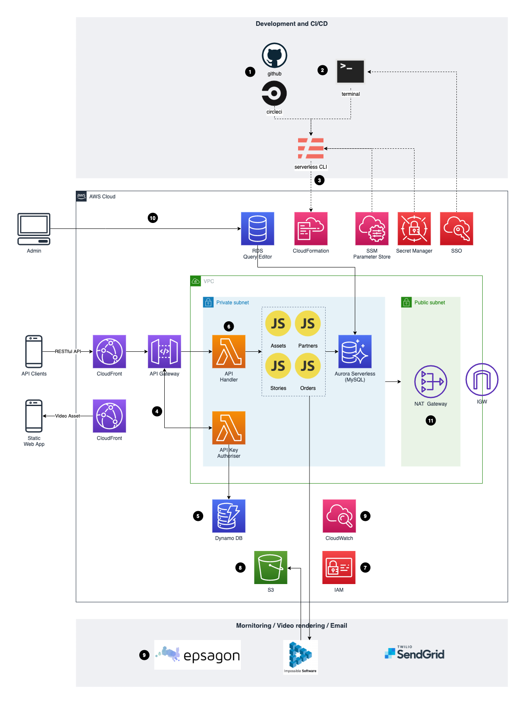

# giftflick.com.au (2020-2021)

## Summary

Over the holiday period, I helped 2 friends of mine build the backend system for their proof-of-concept startup idea.

Tech stack: Node.js, Serverless framework, Lambda, API Gateway, Aurora Serverless, S3, SendGrid, Epsagon

## System design

## Notes

1. Deployments to staging/production environments are automated with CircleCI CI/CD pipelines, which involve triggers from GitHub commit pushes and PR merges, as well as a manual step to approve final production deployment.

2. Ad-hoc deployments to development environment is done through CLI. AWS SSO is utilised to grant AWS credentials to developer's CLI on the fly. Hence explicitly exposing/storing AWS credentials in developer local system is avoided.

3. During CI/CD and ad-hoc deployments, serverless framework retrieves infrastructure configuration (e.g.: RDS capacity, CloudFront alias domain etc) from AWS SSM Parameter Store; the serverless framework also retrieves secrets (Database credentials, API tokens, etc) from AWS Secrets Manager. Hence explicitly exposing/storing important configuration and secrets in codebase or .env files is avoided.

4. A custom API Gateway authorizer Lambda is used to validate API key passed in HTTP request header. Validated API key user account info is returned in the authorisation result, so it can be furthered used by downstream API handling Lambda.

5. API keys and associated info are stored on DynamoDB, which is HA and offers a straightforward data management interface on AWS Console.

6. To reduce cold start and for the sake of ease troubleshooting, a single Lambda function is used to handle all API endpoints. The actual business logic and data operations are fan-out to multiple Javascript modules. All these are packaged into one Lambda function during deployment

7. The external video rendering web service requires multi-part upload permissions to the nominated S3 bucket. During deployment, a dedicated IAM account with minimal privileges is provisioned. This account access secrets are stored as ENV variables and provided to the video rendering web service.

8. To reduce S3 storage cost, S3 lifecycle applies to stored video assets. Files older than 90 days will be removed.

9. Logs and errors are traced both by CloudWatch and Epsagon. While Epsagon provides high-level metrics monitoring (resource utilisation, Lambda cold start, timeout errors, etc) and notifies Ops team via emails, DevOps can always drill down the logs on CloudWatch in more detail.

10. Due to the scope of this proof-of-concept project, we leverage RDS Query Editor for data management tasks.

11. To reduce cost, NAT Instance is used in Dev environment instead.
