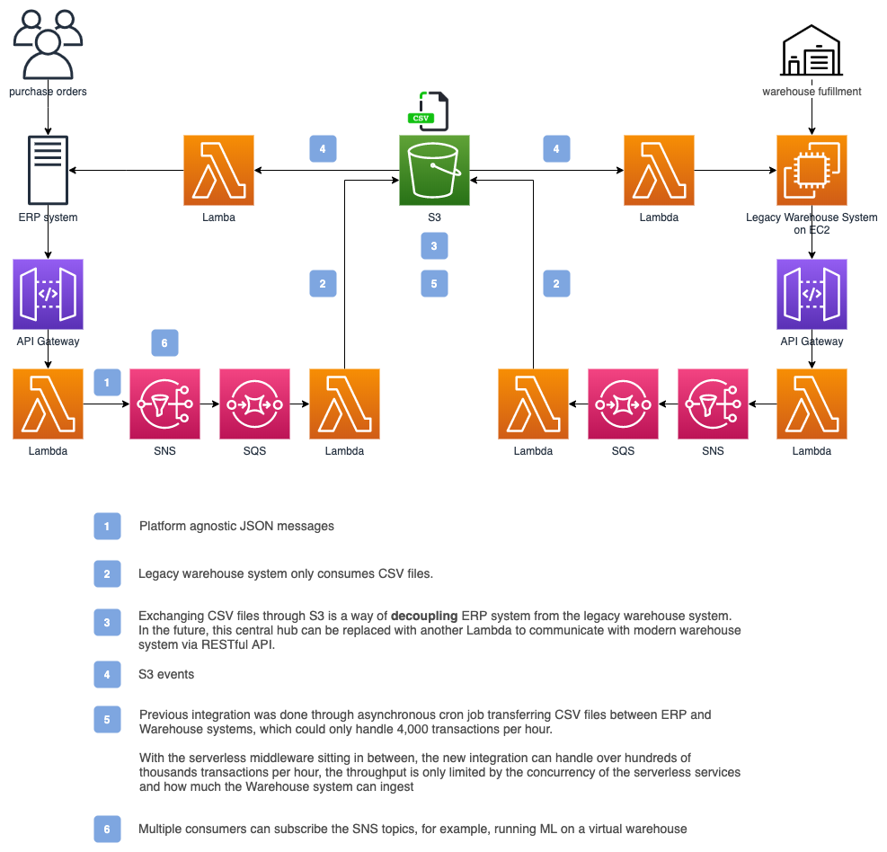

# Gousto: Building a Robust, Asynchronous Message Bus using AWS Lambda, Amazon SNS, and Amazon SQS

## Video

## Summary

[Gousto](https://www.gousto.co.uk/) built a robust, asynchronous message bus using AWS Lambda, Amazon SNS, and Amazon SQS to integrate a microservices platform with ERP and warehouse management systems (WMS), which enabled a near real-time flow of events. We also discuss their roadmap which includes a virtualised simulation of the entire warehouse!

## Diagram

## draw.io file

[https://drive.google.com/file/d/1xUqum5I8XiOmd4w0ued4Z5OntbzRC1l8/view?usp=sharing](https://drive.google.com/file/d/1xUqum5I8XiOmd4w0ued4Z5OntbzRC1l8/view?usp=sharing)
