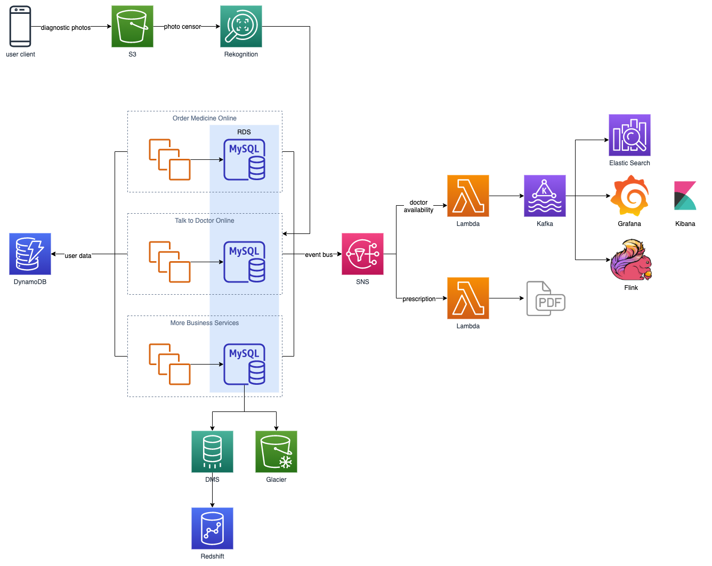

# Halodoc: Building the Future of Tele-Health One Microservice at a Time

## Video

## Summary

[Halodoc](https://www.halodoc.com/), a Jakarta-based healthtech platform, uses tele-health and artificial intelligence to connect patients, doctors, and pharmacies. Join builder Adrian De Luca for this special edition of This is My Architecture as he dives deep into the solutions architecture of this Indonesian healthtech platform that provides healthcare services in one of the most challenging traffic environments in the world. Explore how the company evolved its monolithic back end into decoupled microservices with Amazon EC2 & Amazon Simple Queue Service (SQS), adopted serverless to cost effectively support new user functionality with AWS Lambda, and manages the high volume and velocity of data with Amazon DynamoDB, Amazon Relational Database Service (RDS), and Amazon Redshift.

## System design (recreated)

