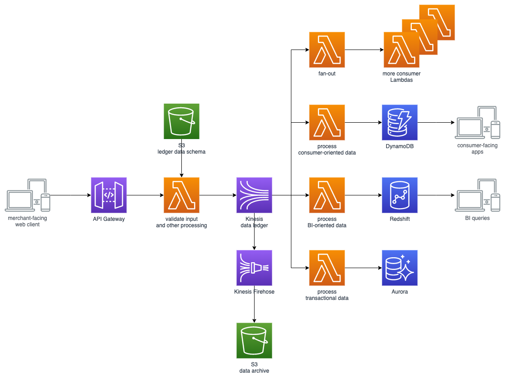

# Nordstrom: Event-Sourced Serverless Architectures

## Video

## Summary

AWS Community Hero and head of [Nordstrom](https://shop.nordstrom.com/)'s Emerging Technology Team, [Rob Gruhl](https://twitter.com/robgruhl), walks us through the concept of an event-sourced architecture. You'll learn how Rob and his team are leveraging Kinesis and many other AWS services to build experiments such as the [Hello, Retail!](https://github.com/Nordstrom/hello-retail) proof-of-concept. This project is 100% serverless and 100% event-sourced, designed around an immutable, ordered, and distributed ledger. We'll dive into the architecture, explain the difference between event-driven and event-source solutions, and show you how to build your own with Kinesis, Kinesis Firehose, S3, API Gateway, and Lambda.

## Diagram

## draw.io file

[https://drive.google.com/file/d/1AirVgvdJ8ZJnLFd1JIfNQK6akj8esdNv/view?usp=sharing](https://drive.google.com/file/d/1AirVgvdJ8ZJnLFd1JIfNQK6akj8esdNv/view?usp=sharing)

## Notes
